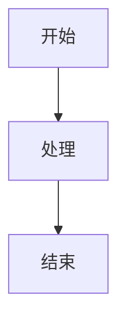

# md2docx

将 Markdown 论文转换为 DOCX 文档，支持 Mermaid 图表、LaTeX 公式、多级目录。

## 特性

- **Mermaid 图表**：通过 mermaid.ink API 渲染流程图、时序图等
- **LaTeX 公式**：matplotlib 本地渲染 + CodeCogs API 降级备份
- **三线表**：标准学术三线表格式
- **多级目录**：outlineLvl 大纲级别 + TOC字段
- **配置驱动**：YAML 模板定义格式
- **隐私保护**：默认模板不含学校信息

## 安装

```bash
pip install md2docx
```

或从源码安装：

```bash
git clone https://github.com/yourusername/md2docx.git
cd md2docx
pip install -e .
```

## 快速开始

```bash
# 转换文件
md2docx convert thesis.md -o thesis.docx

# 使用自定义模板
md2docx convert thesis.md -t custom.yaml -o thesis.docx

# 验证语法
md2docx validate thesis.md

# 预览解析结果
md2docx preview thesis.md
```

## 支持的 Markdown 语法

### 标题

```markdown
## 第 1 章 绪论          # 章标题
### 1.1 研究背景         # 节标题
#### 1.1.1 背景          # 小节标题
```

### 段落与行内公式

```markdown
普通段落，包含行内公式 $E=mc^2$。
```

### 块级公式

```markdown
$$
\frac{\partial u}{\partial t} = \alpha \nabla^2 u
\tag{1-1}
$$
```

### Mermaid 图表

```markdown
**图 1-1 系统架构图**


```

### 表格（三线表）

```markdown
**表 1-1 参数对比**

| 参数 | 值 | 说明 |
|------|-----|------|
| A    | 100 | 参数A |
```

### 图片

```markdown


**图 1-2 示例图片**
```

### 分页符

```markdown
<!-- pagebreak -->
```

## 配置模板

创建 `custom.yaml` 自定义格式：

```yaml
page:
  size: A4
  margins:
    left: 3.0cm
    right: 2.5cm
    top: 2.54cm
    bottom: 2.54cm

fonts:
  default: 宋体
  heading: 黑体
  code: Consolas

body:
  size: 12
  line_spacing: 1.5
  first_line_indent: 0.74cm

table:
  border_top_weight: 1.5
  border_bottom_weight: 1.5
```

## 常见问题

### Q: Mermaid 图表渲染失败？

检查网络连接，mermaid.ink API 需要外网访问。

### Q: 公式显示乱码？

确保公式语法正确，必要时使用 `\text{}` 包裹中文。

### Q: 如何更新目录？

在 Word 中按 F9 更新目录字段。

## 许可证

MIT License
