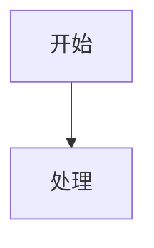

# md2docx - Markdown 论文转 DOCX 工具设计文档

## 概述

**项目名称**：md2docx
**目标**：创建一个通用的 Markdown 论文转 DOCX 工具，支持 Mermaid 图表、LaTeX 公式、多级目录，配置文件驱动，适合 GitHub 开源分享。

## 核心需求

1. **Mermaid 图表渲染**：通过 mermaid.ink API 将代码块转为 PNG 图片
2. **LaTeX 公式渲染**：matplotlib 本地渲染为主，CodeCogs API 为降级备份
3. **多级目录**：通过 outlineLvl 大纲级别 + TOC 字段实现，Word 中 F9 更新
4. **配置文件驱动**：YAML 模板定义格式，用户可自定义
5. **隐私保护**：默认模板不包含任何具体学校信息
6. **GitHub 友好**：清晰文档、标准项目结构、pip 可安装

## Markdown 语法参考

本工具识别以下 Markdown 语法：

### 标题

```markdown
## 第 1 章 绪论          # 章标题（一级大纲）
### 1.1 研究背景         # 节标题（二级大纲）
#### 1.1.1 背景          # 小节标题（三级大纲）
```

### 段落与行内公式

```markdown
普通段落文本，可包含行内公式 $E=mc^2$ 和 **粗体**、*斜体*。
```

### 块级公式

```markdown
$$
\frac{\partial u}{\partial t} = \alpha \nabla^2 u
\tag{1-1}
$$
```

- `$$` 独占一行表示公式块开始/结束
- `\tag{}` 指定公式编号（可选）

### Mermaid 图表

```markdown
**图 1-1 系统架构图**


```

- 图表标题写在代码块前一行，格式为 `**图 X-Y 标题**`
- 支持 flowchart, sequence, class, state 等所有 mermaid 类型

### 表格

```markdown
**表 1-1 参数对比**

| 参数 | 值 | 说明 |
|------|-----|------|
| A    | 100 | 参数A |
| B    | 200 | 参数B |
```

- 表格标题写在表格前一行，格式为 `**表 X-Y 标题**`
- 使用标准 GFM 表格语法

### 代码块

```markdown
```python
def hello():
    print("Hello")
```
```

### 图片引用

```markdown


**图 1-2 示例图片**
```

- 图片路径支持相对路径（相对于 MD 文件）和绝对路径
- 图片标题格式同 Mermaid 图表

### 分页符

```markdown
<!-- pagebreak -->
```

### 摘要区

```markdown
## 摘要

摘要正文内容...

**关键词**：关键词1；关键词2；关键词3

---

## ABSTRACT

Abstract content in English...

**KEY WORDS**: keyword1; keyword2; keyword3
```

## 项目结构

```
md2docx/
├── __init__.py          # 版本信息
├── cli.py               # 命令行入口
├── parser.py            # Markdown 解析器
├── renderer/
│   ├── __init__.py
│   ├── mermaid.py       # Mermaid 图表渲染
│   ├── formula.py       # LaTeX 公式渲染
│   ├── table.py         # 表格渲染
│   └── docx_builder.py  # DOCX 文档构建
├── formatter.py         # 格式化工具（字体、间距、大纲级别）
├── config.py            # 配置加载与验证
├── templates/
│   ├── default.yaml     # 默认通用模板
│   └── example.yaml     # 示例自定义模板
├── README.md            # 使用文档
├── requirements.txt     # 依赖
└── setup.py             # pip 安装配置
```

## 命令行接口

### 命令概览

```bash
# 转换（核心命令）
md2docx input.md -o output.docx -t template.yaml

# 验证 MD 格式
md2docx validate input.md

# 预览解析结果
md2docx preview input.md

# 显示帮助
md2docx --help
md2docx convert --help

# 显示版本
md2docx --version
```

### 参数说明

| 参数 | 简写 | 说明 | 默认值 |
|------|------|------|--------|
| `--output` | `-o` | 输出路径 | 同名 .docx |
| `--template` | `-t` | 模板配置文件 | 内置 default.yaml |
| `--verbose` | `-v` | 详细输出模式 | 关闭 |
| `--version` | | 版本信息 | |

### validate 命令

**功能**：检查 Markdown 文件语法规范

**输出示例**：
```
[INFO] 检查 input.md
[OK] 标题层级: 发现 12 个标题
[OK] 公式块: 发现 8 个块级公式
[OK] Mermaid 图: 发现 5 个图表
[WARN] 第 45 行: 表格缺少标题
[ERROR] 第 78 行: 未闭合的代码块
```

**检查项**：
- 标题层级是否合理
- 公式块是否正确闭合
- 代码块是否正确闭合
- 表格是否有标题
- 图片路径是否存在

### preview 命令

**功能**：输出解析后的元素列表（不生成 DOCX）

**输出示例**：
```
[INFO] 解析 input.md

## 元素列表

[1] Heading (level=2): "第 1 章 绪论"
[2] Paragraph: "滑坡、泥石流一类的地质灾害..."
[3] Heading (level=3): "1.1 研究背景"
[4] MermaidBlock: "flowchart TB..." (caption: "图 1-1 系统架构")
[5] FormulaBlock: "\frac{\partial u}..." (tag: "1-1")
[6] Table: 3列5行 (caption: "表 1-1 参数对比")

## 统计

- 标题: 12 个
- 段落: 45 个
- 公式: 8 个
- 图表: 5 个
- 表格: 3 个
```

## 配置模板格式

```yaml
# thesis_template.yaml

# 文档元信息
document:
  title_zh: "论文题目"
  title_en: "Thesis Title"
  author: ""
  date: ""

# 页面设置
page:
  size: A4
  margins:
    left: 3.0cm
    right: 2.5cm
    top: 2.54cm
    bottom: 2.54cm

# 字体设置
fonts:
  default: 宋体
  heading: 宋体
  code: Consolas
  formula: Times New Roman

# 标题样式
headings:
  chapter:          # ## 标题（章）
    size: 18
    bold: true
    align: center
  section:         # ### 标题（节）
    size: 14
    bold: true
    align: left
  subsection:      # #### 标题（小节）
    size: 12
    bold: true
    indent: true

# 正文样式
body:
  size: 12
  line_spacing: 1.5
  first_line_indent: 0.74cm

# 图表设置
figures:
  max_width: 14cm
  caption_size: 9
  caption_font: 宋体

# 目录设置
toc:
  enabled: true
  levels: "1-3"

# 封面页（可选）
cover:
  enabled: false
  # 封面模板文件路径，支持 .docx 或 .md 格式
  # .docx: 直接作为封面页插入
  # .md: 解析后按正文样式渲染
  template: ""

# 摘要设置
abstract:
  # 是否从 MD 中自动提取摘要
  auto_extract: true
  # 摘要标题样式
  title_size: 18
  title_font: 宋体
  # 摘要正文样式
  body_size: 12
  body_font: 宋体

# 页眉页脚
header_footer:
  header_text: ""
  header_font_size: 10.5
  page_number_start: 1

# 公式渲染设置
formula:
  # 中文替换表（LaTeX 不支持中文时的替代方案）
  chinese_replacements:
    "滑坡": "LS"
    "泥石流": "DF"
    "崩塌": "RB"
    # 用户可自定义扩展

# 表格设置
table:
  # 三线表边框样式
  border_top_weight: 1.5    # 顶线粗细 (pt)
  border_header_weight: 1.0 # 表头底线粗细
  border_bottom_weight: 1.5 # 底线粗细
  border_color: "000000"    # 边框颜色 (RGB)
```

## 核心模块设计

### 模块边界说明

- **formatter.py**：提供**纯函数工具**，不持有状态，仅操作传入的 `run`/`paragraph` 对象
- **docx_builder.py**：**协调器角色**，持有 `Document` 实例，调用 parser 获取元素，调用 renderer 渲染，调用 formatter 设置格式

### parser.py - Markdown 解析器

**职责**：将 MD 文本解析为结构化元素列表

**元素类型定义**：

```python
@dataclass
class HeadingElement:
    level: int        # 2=章, 3=节, 4=小节
    text: str         # 标题文本

@dataclass
class ParagraphElement:
    text: str
    has_inline_math: bool  # 是否包含 $...$ 行内公式

@dataclass
class MermaidBlockElement:
    code: str        # mermaid 代码
    caption: str     # 图标题（如 "图 1-1 系统架构"）

@dataclass
class FormulaBlockElement:
    latex: str       # LaTeX 代码
    tag: str         # 公式编号（从 \tag{} 提取），空字符串表示无编号

@dataclass
class TableElement:
    headers: List[str]
    rows: List[List[str]]
    caption: str     # 表标题

@dataclass
class CodeBlockElement:
    code: str
    language: str    # 语言标识，空字符串表示未指定

@dataclass
class ImageElement:
    path: str        # 图片路径（已转换为绝对路径）
    caption: str     # 图片标题

@dataclass
class PageBreakElement:
    pass             # 无属性，仅表示分页

@dataclass
class AbstractElement:
    lang: str        # "zh" 或 "en"
    body: str        # 摘要正文
    keywords: str    # 关键词
```

**解析策略**：
1. 逐行扫描，识别块级元素起始标记
2. 状态机管理嵌套（如 ```mermaid 块）
3. 提取元信息（图表标题、公式标签）
4. 自动识别摘要区（`## 摘要` 和 `## ABSTRACT`）

### renderer/mermaid.py - Mermaid 渲染器

**API 调用流程**：
1. JSON 配置 `{code, mermaid: {theme: "default"}}`
2. zlib 压缩 + base64 URL 安全编码
3. 请求 `https://mermaid.ink/img/pako:{encoded}`
4. 返回 PNG 字节数据

**错误处理**：

| 错误类型 | 处理策略 |
|---------|---------|
| 网络超时 (>25s) | 重试 1 次，失败则降级 |
| HTTP 4xx | 不重试，直接降级（客户端错误） |
| HTTP 5xx | 重试 1 次，失败则降级 |
| HTTP 429 (限流) | 等待 2 秒后重试，失败则降级 |
| 无效 Mermaid 语法 | 记录警告，降级为占位符 |
| 返回数据过小 (<100 bytes) | 视为失败，降级 |

**降级策略**：
- 插入占位符段落：`【图 X-Y: Mermaid 图表渲染失败，请手动插入】`
- 在 verbose 模式下输出详细错误信息

### renderer/formula.py - 公式渲染器

**渲染器选择逻辑**：

```python
def is_complex_formula(latex: str) -> bool:
    """判断是否为复杂公式（matplotlib 不支持）"""
    complex_envs = [r'\begin{cases}', r'\begin{align}', r'\begin{split}',
                    r'\begin{gather}', r'\begin{eqnarray}', r'\begin{matrix}']
    return any(env in latex for env in complex_envs)
```

**渲染流程**：
```
latex_code
    │
    ▼
┌─────────────────┐
│ 预处理          │ ──→ 中文替换、\tag{} 移除
└─────────────────┘
    │
    ▼
┌─────────────────┐     是      ┌─────────────────┐
│ is_complex?     │ ──────────→ │ CodeCogs API    │
└─────────────────┘             └─────────────────┘
    │ 否                              │
    ▼                                 ▼
┌─────────────────┐             ┌─────────────────┐
│ matplotlib      │             │ 返回 PNG        │
└─────────────────┘             └─────────────────┘
    │                                 │
    ▼                                 ▼
┌─────────────────┐             失败则降级为
│ 成功 → PNG      │             斜体文字占位符
│ 失败 → CodeCogs │
└─────────────────┘
```

**错误处理**：

| 渲染器 | 错误类型 | 处理策略 |
|--------|---------|---------|
| matplotlib | 解析错误 | 降级到 CodeCogs |
| matplotlib | 渲染错误 | 降级到 CodeCogs |
| CodeCogs | 网络超时 (>25s) | 降级为文字占位符 |
| CodeCogs | HTTP 错误 | 降级为文字占位符 |
| 两者均失败 | - | 输出斜体 LaTeX 源码 |

**中文替换**：
- 从配置文件 `formula.chinese_replacements` 读取映射表
- 替换 `\text{中文}` 为 `\mathrm{英文缩写}`

### renderer/table.py - 表格渲染器

**三线表定义**：

三线表由三条横线组成：
1. **顶线**：表格最上方，1.5pt 粗
2. **表头底线**：表头与内容之间，1.0pt 粗
3. **底线**：表格最下方，1.5pt 粗

**实现方式**：
- 使用 python-docx 的 `Table` 对象
- 通过 OxmlElement 设置段落边框
- 边框粗细从配置 `table.border_*_weight` 读取

**处理流程**：
1. 解析 MD 表格语法（header 行、separator 行、data 行）
2. 创建表格，设置 `Table Grid` 基础样式
3. 设置表头单元格：加粗、居中
4. 设置内容单元格：居中
5. 添加三线表边框
6. 表格上方插入标题段落

### renderer/docx_builder.py - DOCX 构建器

**职责**：接收元素流，构建完整 DOCX 文档

**构建顺序**：
1. 设置页面属性（尺寸、边距）
2. 添加封面页（如 `cover.enabled=true` 且 `cover.template` 存在）
3. 添加摘要页（从 MD 中提取 `AbstractElement`）
4. 插入目录字段（如 `toc.enabled=true`）
5. 添加分节符（分隔前置页与正文）
6. 逐元素写入正文
7. 设置页眉页脚

**封面模板支持**：
- `.docx` 文件：直接插入作为封面页
- `.md` 文件：解析后按正文样式渲染

### formatter.py - 格式化工具

**核心函数**：

```python
def set_run_font(run, font_name='宋体', bold=False, size=12, italic=False):
    """统一设置 Run 字体（中英文）"""

def set_para_spacing(para, space_before=0, space_after=0,
                     line_spacing=1.5, indent_cm=None, align='left'):
    """设置段落间距与对齐"""

def set_outline_level(para, level):
    """设置段落大纲级别（0=章, 1=节, 2=小节）"""

def add_header_border(header):
    """在页眉段落底部添加单实线边框"""
```

### config.py - 配置管理

**职责**：
1. YAML 文件加载
2. 字段验证与默认值填充
3. 单位解析（`"3.0cm"` → `Cm(3.0)`）

**配置验证**：

```python
REQUIRED_FIELDS = ['page', 'fonts', 'body']
DEFAULT_VALUES = {
    'page.size': 'A4',
    'fonts.default': '宋体',
    'body.size': 12,
    'body.line_spacing': 1.5,
    # ...
}

def validate_config(config: dict) -> dict:
    """验证配置，填充默认值，返回规范化的配置对象"""
```

**错误处理**：
- 缺少必需字段：抛出 `ConfigError` 并提示缺少字段
- 无效值（如 `line_spacing: "abc"`）：抛出 `ConfigError` 并提示有效值范围
- 单位格式错误：抛出 `ConfigError` 并提示正确格式

## 数据流程

```
input.md
    │
    ▼
┌─────────────┐
│   parser    │ ──→ 元素列表 [Heading, Paragraph, MermaidBlock, ...]
└─────────────┘
    │
    ▼
┌─────────────┐
│  renderer   │ ──→ 渲染元素（Mermaid→PNG, Formula→PNG）
└─────────────┘
    │
    ▼
┌─────────────┐
│ docx_builder│ ──→ 按配置组装 DOCX
└─────────────┘
    │
    ▼
output.docx
```

## 错误处理策略

### 错误分类

| 错误类型 | 错误码 | 处理方式 |
|---------|--------|---------|
| 输入文件不存在 | E001 | 打印错误信息，退出码 1 |
| 输出目录不存在 | E002 | 询问是否创建，或退出 |
| 配置文件语法错误 | E003 | 指出错误位置，退出码 1 |
| 配置字段缺失/无效 | E004 | 列出错误字段，退出码 1 |
| Mermaid 渲染失败 | W001 | 警告 + 降级为占位符 |
| 公式渲染失败 | W002 | 警告 + 降级为文字 |
| 图片文件不存在 | W003 | 警告 + 跳过 |
| 网络请求超时 | W004 | 警告 + 重试/降级 |

### 用户提示

- **错误 (E)**：以 `[ERROR]` 开头，阻止继续执行
- **警告 (W)**：以 `[WARN]` 开头，继续执行但降级处理
- **信息 (I)**：以 `[INFO]` 开头，`-v` 模式下输出

## 日志策略

### 日志级别

| 级别 | 输出内容 |
|------|---------|
| 默认 | 仅输出错误和最终结果 |
| `-v` | 增加：每个元素的渲染状态 |
| `-vv` | 增加：网络请求详情、配置解析过程 |

### 输出格式

```
[INFO] 读取配置: default.yaml
[INFO] 解析 Markdown...
[INFO] 发现 12 个标题, 8 个公式, 5 个图表
[INFO] 渲染 Mermaid 图 1/5...
[OK] Mermaid 图 1-1 渲染成功
[WARN] Mermaid 图 2-3 渲染失败，使用占位符
[INFO] 渲染公式 1/8...
[OK] 公式 (1-1) 渲染成功
[INFO] 构建 DOCX...
[SUCCESS] 输出文件: output.docx
```

## 测试策略

### 测试文件组织

```
tests/
├── __init__.py
├── test_parser.py       # 解析器单元测试
├── test_renderer/
│   ├── test_mermaid.py  # Mermaid 渲染测试（mock API）
│   ├── test_formula.py  # 公式渲染测试（mock API）
│   └── test_table.py    # 表格渲染测试
├── test_config.py       # 配置解析测试
├── test_integration.py  # 端到端集成测试
└── fixtures/
    ├── simple.md        # 简单测试文件
    ├── full.md          # 完整功能测试文件
    └── invalid.md       # 错误语法测试文件
```

### 测试覆盖

| 模块 | 覆盖重点 |
|------|---------|
| parser | 各元素类型解析、边界情况 |
| mermaid | API 调用、错误处理、降级逻辑 |
| formula | 复杂公式检测、双渲染器切换 |
| table | 三线表格式、标题解析 |
| config | 默认值填充、错误检测 |
| integration | 完整转换流程 |

### API Mock 策略

- Mermaid/CodeCogs API 使用 `unittest.mock` 或 `responses` 库 mock
- 避免测试时发起真实网络请求

## 依赖

```
python-docx>=0.8.11
PyYAML>=6.0
requests>=2.28.0
matplotlib>=3.6.0
```

## 文档规划

README.md 包含：
1. 项目介绍与特性
2. 安装方法
3. 快速开始
4. 命令行参数详解
5. 配置模板说明
6. 支持的 Markdown 语法
7. 常见问题
8. 贡献指南

## 隐私保护

- 默认模板 `default.yaml` 不包含任何学校、院系信息
- 封面相关配置默认禁用
- 示例模板 `example.yaml` 使用占位符

## 后续扩展（可选）

- [ ] 批量转换支持
- [ ] 更多预设模板
- [ ] 图片本地化选项
- [ ] 自定义 CSS 样式
