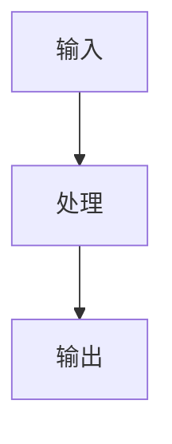

## 第 1 章 绪论

### 1.1 研究背景

滑坡、泥石流等地质灾害频发。

**图 1-1 系统架构**

```mermaid
flowchart TB
    A[输入] --> B[处理] --> C[输出]
```

公式如下：

$$
E = mc^2
\tag{1-1}
$$

| 参数 | 值 |
|------|-----|
| 质量 | 10 |

<!-- pagebreak -->

## 第 2 章 方法
